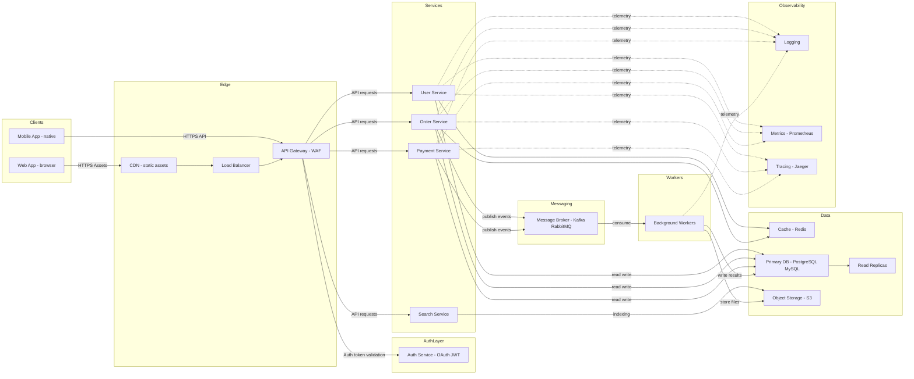

# 🎯 Task Management System - JIRA Style

> A modern, full-stack task management application inspired by Atlassian JIRA

[](https://www.typescriptlang.org/)
[](https://reactjs.org/)
[](https://nodejs.org/)
[](LICENSE)

## 📋 Table of Contents

- [Overview](#overview)
- [Features](#features)
- [Architecture](#architecture)
- [Quick Start](#quick-start)
- [Documentation](#documentation)
- [Testing](#testing)
- [Contributing](#contributing)

## 🌟 Overview

This project consists of two integrated applications:

- **lesson-10**: React frontend with JIRA-style UI
- **lesson-11**: Node.js/Express/Sequelize backend with TSOA

Together they provide a complete task management system with drag-and-drop functionality, user management, and modern UI/UX.

## ✨ Features

### 🎨 JIRA-Style UI

- Modern Atlassian design language
- Professional color scheme (`#0052cc`, `#172b4d`, `#5e6c84`)
- Compact, information-dense layouts
- Smooth animations and transitions

### 📋 Task Management

- **Drag & Drop**: Move tasks between columns (TO DO → IN PROGRESS → DONE)
- **Priority System**: High/Medium/Low with color coding
- **User Assignment**: Assign tasks to team members
- **Status Tracking**: Visual kanban board

### 👥 User Management

- Create, read, update, delete users
- Active/inactive status
- Email validation
- Last login tracking

### 📝 Posts System

- Create posts linked to users
- Edit and delete functionality
- Content management

### 🔧 Technical Features

- **Type Safety**: Full TypeScript coverage
- **Validation**: Zod schemas on frontend and backend
- **API Documentation**: Auto-generated Swagger docs
- **Testing**: Unit and integration tests
- **ESLint**: Code quality enforcement
- **Hot Reload**: Fast development experience

## 🏗️ Architecture

```
┌─────────────────┐
│   React App     │  Port 5173
│   (lesson-10)   │  Vite Dev Server
└────────┬────────┘
         │ HTTP Proxy /api → :3000
         ↓
┌─────────────────┐
│  Express API    │  Port 3000
│  (lesson-11)    │  TSOA + Sequelize
└────────┬────────┘
         │
         ↓
┌─────────────────┐
│   PostgreSQL    │
│    Database     │
└─────────────────┘
```

## 🚀 Quick Start

### Prerequisites

- Node.js 18+
- PostgreSQL
- npm or yarn

### Installation

1. **Clone the repository**

```bash
git clone <repository-url>
cd ts-new-project
```

2. **Install dependencies**

```bash
# Backend
cd lesson-11
npm install

# Frontend
cd ../lesson-10
npm install
```

3. **Configure database**
   Update `lesson-11/src/config/database.ts` with your PostgreSQL credentials.

4. **Start the application**

Terminal 1 - Backend:

```bash
cd lesson-11
npm run dev
```

Terminal 2 - Frontend:

```bash
cd lesson-10
npm run dev
```

5. **Access the application**

- Frontend: http://localhost:5173
- Backend API: http://localhost:3000
- Swagger Docs: http://localhost:3000/swagger

## 📚 Documentation

- [Integration Guide](INTEGRATION_GUIDE.md) - Complete setup guide
- [JIRA Style Update](JIRA_STYLE_UPDATE.md) - Design system details
- [How to Use](HOW_TO_USE.md) - User guide
- [Changes Summary](CHANGES_SUMMARY.md) - Complete changelog
- [Assignee Fix](ASSIGNEE_FIX.md) - Recent bug fixes

### Project-Specific READMEs

- [Frontend README](lesson-10/README.md)
- [Backend README](lesson-11/README.md)

## 🧪 Testing

### Frontend Tests

```bash
cd lesson-10
npm test              # Watch mode
npm run test:run      # Run once
npm run test:ui       # UI mode
```

### Backend Tests

```bash
cd lesson-11
npm test              # Run tests
npm run test:coverage # With coverage
```

## 🎨 Design System

### Colors (Atlassian JIRA)

- **Primary Blue**: `#0052cc`
- **Dark Blue**: `#0747a6`
- **Text Primary**: `#172b4d`
- **Text Secondary**: `#5e6c84`
- **Background**: `#f4f5f7`
- **Cards**: `#ffffff`
- **Columns**: `#ebecf0`

### Priority Colors

- **High**: `#de350b` (Red)
- **Medium**: `#ff991f` (Orange)
- **Low**: `#36b37e` (Green)

### Typography

- **Font Family**: System fonts
- **Sizes**: 0.75rem - 1.5rem
- **Weights**: 400, 500, 600, 700

## 🛠️ Tech Stack

### Frontend (lesson-10)

- React 19.2
- TypeScript 5.9
- Vite 7.2
- React Router 7.9
- React Hook Form 7.66
- Zod 4.1
- Vitest 4.0

### Backend (lesson-11)

- Node.js 18+
- Express 5.1
- TypeScript 5.9
- Sequelize 6.37
- TSOA 6.1
- Zod 4.1
- PostgreSQL
- Vitest 4.0

## 📝 API Endpoints

### Users

- `GET /users` - List users
- `GET /users/:id` - Get user
- `POST /users` - Create user
- `PUT /users/:id` - Update user
- `DELETE /users/:id` - Delete user

### Tasks

- `GET /tasks` - List tasks
- `GET /tasks/:id` - Get task
- `POST /tasks` - Create task
- `PUT /tasks/:id` - Update task (supports status change)
- `DELETE /tasks/:id` - Delete task

### Posts

- `GET /posts` - List posts
- `GET /posts/:id` - Get post
- `POST /posts` - Create post
- `PUT /posts/:id` - Update post
- `DELETE /posts/:id` - Delete post

## 🤝 Contributing

1. Fork the repository
2. Create a feature branch (`git checkout -b feature/amazing-feature`)
3. Commit your changes (`git commit -m 'Add amazing feature'`)
4. Push to the branch (`git push origin feature/amazing-feature`)
5. Open a Pull Request

### Code Style

- Follow ESLint rules
- Write tests for new features
- Update documentation
- Use conventional commits

## 📄 License

This project is licensed under the MIT License.

## 🙏 Acknowledgments

- Inspired by [Atlassian JIRA](https://www.atlassian.com/software/jira)
- Built with modern web technologies
- Community-driven development

## 📞 Support

For issues and questions:

- Check existing documentation
- Review closed issues
- Open a new issue with details

---

Made with ❤️ using React, TypeScript, and Node.js



## Component Summary

- **Clients**: Web and mobile applications used by end users.
- **Edge**: CDN for static assets, Load Balancer for traffic distribution, API Gateway for routing and WAF.
- **Auth Service**: Centralized authentication and authorization using OAuth and JWT.
- **Services**: Microservices (User, Order, Payment, Search) handling domain logic.
- **Messaging**: Event bus/message broker for decoupled async communication.
- **Workers**: Background processors for long-running jobs, retries, and batch work.
- **Data**: Primary relational database with read replicas, Redis cache for hot data, and object storage for files.
- **Observability**: Central logging, metrics, and tracing to monitor health and diagnose issues.
