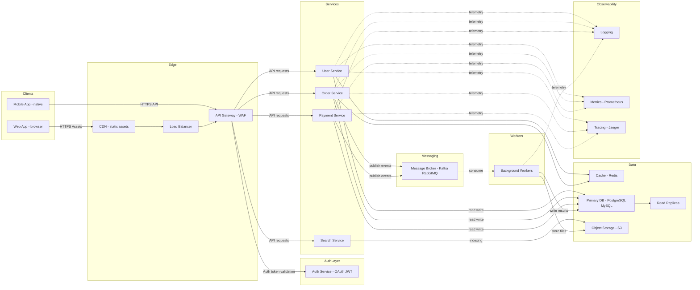

# Architecture Overview
<!-- TEST_BADGES_START -->

<!-- TEST_BADGES_END -->

This document contains a high-level architecture diagram for a typical web application platform.

The diagram shows the main components and their interactions: clients, edge/network, API & services, data stores, messaging, background workers, and observability.

## Component Summary

- **Clients**: Web and mobile applications used by end users.
- **Edge**: CDN for static assets, Load Balancer for traffic distribution, API Gateway for routing and WAF.
- **Auth Service**: Centralized authentication and authorization using OAuth and JWT.
- **Services**: Microservices (User, Order, Payment, Search) handling domain logic.
- **Messaging**: Event bus/message broker for decoupled async communication.
- **Workers**: Background processors for long-running jobs, retries, and batch work.
- **Data**: Primary relational database with read replicas, Redis cache for hot data, and object storage for files.
- **Observability**: Central logging, metrics, and tracing to monitor health and diagnose issues.

---

---

---

---

## 📊 Test Summary

- **Total tests:** 264

